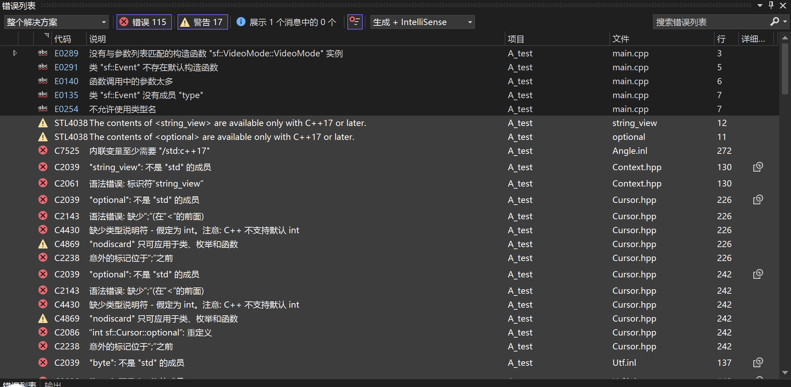
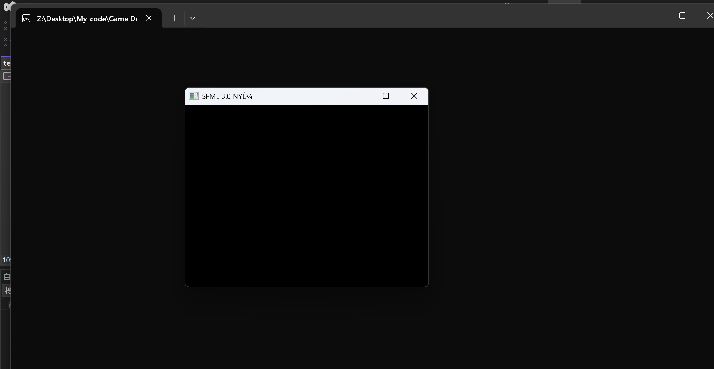
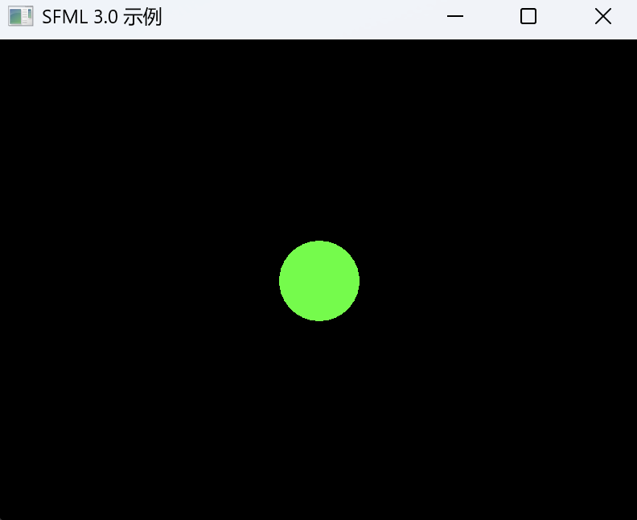
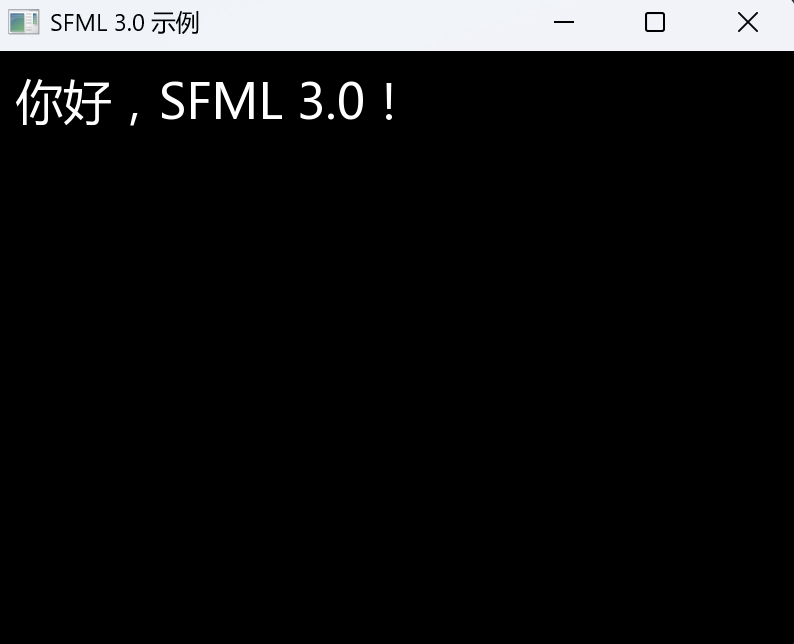
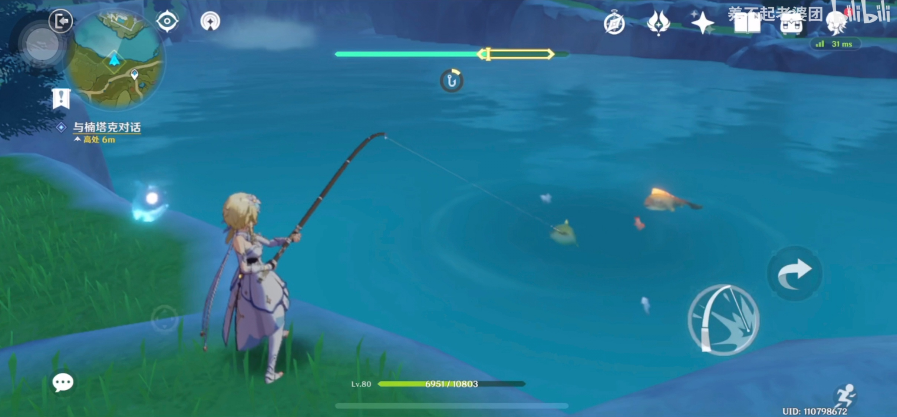
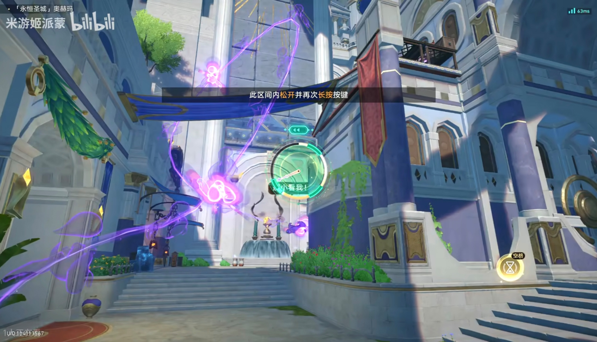
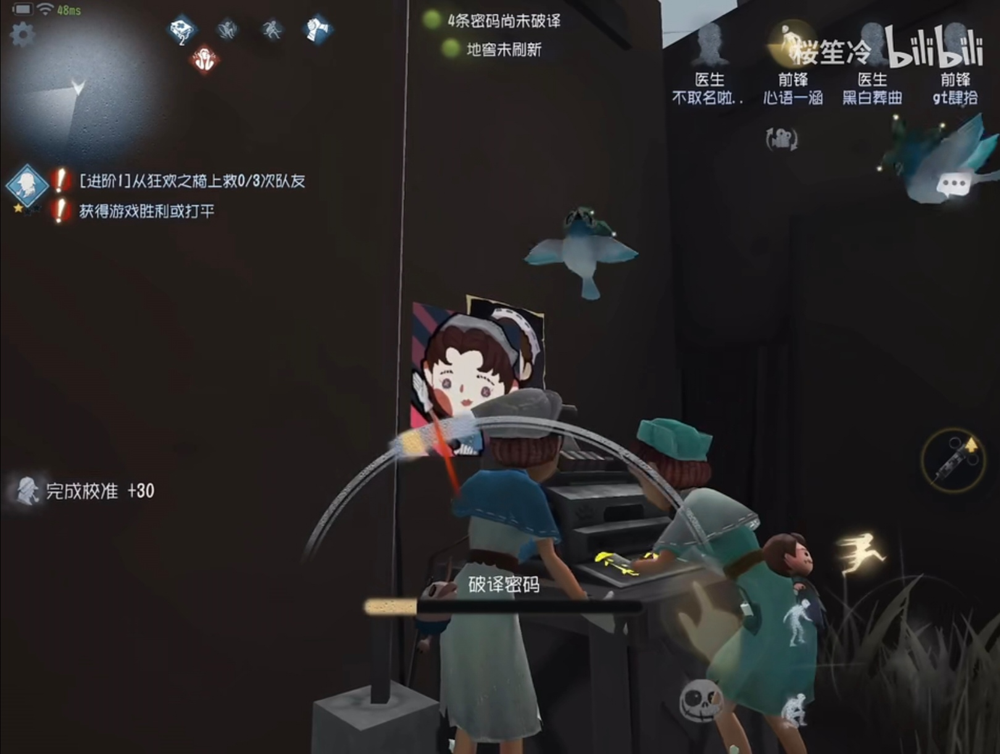
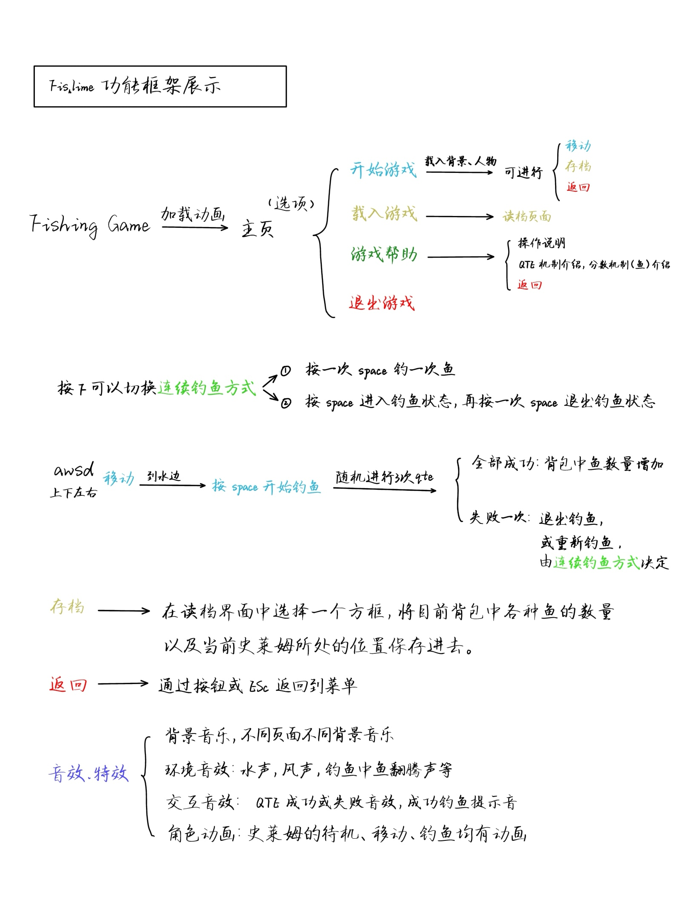
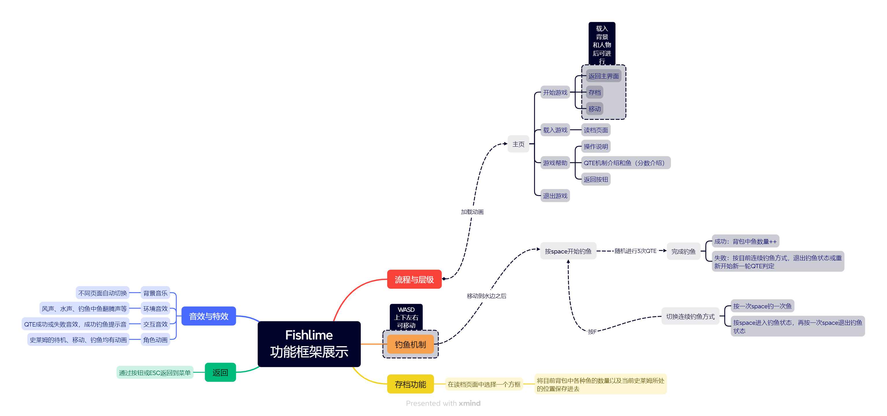

# IDE配置及游戏原型设计

<center>
  小组：
</center>

<center>
  逻辑写不队
</center>

​	环境基础：

> 操作系统：Windows11
>
> IDE：Visual Studio 2022

## 一、环境配置

### 1. 下载 SFML 3.0 SDK

​	访问 SFML 官网下载页（`https://www.sfml-dev.org/fr/download/sfml/3.0.0/`），选择 “Visual C++ 17 (2022) – 64 bit” 版本并下载安装包。

### 2. 解压下载文件，并放到特定目录中待用

### 3. 新建 VS2022 项目

​	在 “解决方案资源管理器” 中右键项目 → “属性”，确保“平台”是 x64（如果不是x64，如可能是ARM64，需要在配置管理器中修改平台为x64，以防止有不可预料的兼容性问题），配置选 Debug，然后选择平台为“所有平台”，使得后面统一配置到 “所有配置”。

​	注意，请确保C++语言标准为 /std:c++17 标准，否则会在运行项目时出现报错！（因为 SFML 3.0 的头文件里用到了 C++17 的特性，如果使用 C++14 及以前的标准，就无法正常运行，出现如下所示的报错。）



### 4. 配置包含目录

​	在项目属性 → VC++目录 → 包含目录中，添加刚刚解压得到的 include 文件夹，格式为：xxx\SFML-3.0.0\include。

### 5. 配置库目录

​	在项目属性 → 链接器 → 常规 → 附加库目录中，添加刚刚解压得到的 lib 文件夹，格式为：xxx\SFML-3.0.0\lib。

### 6. 添加依赖库

​	在项目属性 → 链接器 → 输入 → 附加依赖项中，添加：

```vbnet
sfml-system-d.lib
sfml-window-d.lib
sfml-graphics-d.lib
sfml-audio-d.lib
sfml-network-d.lib
```

### 7. **复制 DLL 到输出目录**

​	复制解压后得到的 SFML-3.0.0\bin 中的所有 `sfml-*-d-3.dll` 文件，到程序根目录（非解决方案目录）下的 x64\Debug 文件夹中（如果没有可以先自行建立文件夹，因为这个文件夹是在编译后才会生成）。

​	如此以上，就可以使用SFML3.0.0进行游戏开发了。

## 二、SFML样例演示

### 1. 使用SFML创建一个窗口

```c++
#include <SFML/Window.hpp>
#include <SFML/Graphics.hpp>

int main(){
    // 创建窗口
    sf::RenderWindow window(
        sf::VideoMode({800, 600}),
        "SFML 3.0 演示"
    );

    while (window.isOpen()){
        while (auto evOpt = window.pollEvent()){
            auto& ev = *evOpt;
            if (ev.is<sf::Event::Closed>()) 
                window.close();
        }

        window.clear();
        window.display();
    }

    return 0;
}
```



​	效果如图所示，在窗口标题中，原本应该是中文，却变成了乱码。

​	根本原因在于源代码文件的编码格式与编译器解析字符串字面量的方式不匹配，需要把 UTF-8 编码的字节串准确地转换成 SFML 内部的 UTF-32。其中一个解决方法，是先准备一个 UTF-8 编码的 std::string，然后用 fromUtf8 将字节流转成 sf::String（UTF-32），再使用转换后的字节串，即可正常显示中文，该部分代码如下：

```C++
// 1. 创建窗口
    // 1. 构造 VideoMode（内部是 Vector2u）
sf::VideoMode vm({ 800, 600 });
    // 2. 准备好一个 UTF-8 编码的 std::string
std::string utf8 = u8"SFML 3.0 示例";
    // 3. 用 fromUtf8 将字节流转成 sf::String（UTF-32）
sf::String title = sf::String::fromUtf8(utf8.begin(), utf8.end());
    // 4. 用转换后的 title 构造窗口
sf::RenderWindow window(vm, title);
```

​	然后再尝试绘制一个圆形：

```c++
// 1. 准备一个圆形
sf::CircleShape circle(50.f);    // 半径 50
circle.setFillColor(sf::Color::Green);
// 把圆心移动到窗口中央（800/2,600/2）
circle.setOrigin({ 50.f, 50.f }); //将 circle 的原点从默认的左上角移动到圆心
circle.setPosition({ 400.f, 300.f });

// 2. 主循环
while (window.isOpen()) {
    // 2.1 事件处理
    while (auto evOpt = window.pollEvent()) {
        auto& ev = *evOpt;
        if (ev.is<sf::Event::Closed>())
            window.close();
    }

    // 2.2 清屏（黑色背景）
    window.clear();

    // 2.3 绘制（这里把 circle 画进来）
    window.draw(circle);

    // 2.4 更新到屏幕
    window.display();
}
```

​	运行以上两段综合后的代码，可以得到以下结果：



### 2. 尝试在窗口内部显示中文

​	上述提到的方法在实际运用中还是太过麻烦，查找资料后找到另一个解决方案：**使用宽字符串字面量 (L"...")**。

​	这个方法利用了 Windows 对宽字符（`wchar_t`）的原生支持，只需要将代码中的所有中文字符串修改为使用 `L` 前缀即可，示例如下：

```C++
#define SFML_DYNAMIC
#include <SFML/Graphics.hpp>
#include <string>
#include <iostream>

int main() {
    // 1. 创建窗口
    sf::VideoMode vm{ {800, 600} };
    sf::RenderWindow window{vm, (L"SFML 3.0 示例") };

    // 2. 加载字体
    sf::Font font;
    if (!font.openFromFile("font/msyh.ttf")) {
        std::cerr << "无法加载字体文件！\n";
        return -1;
    }   

    // 3. 准备中文
    sf::Text prompt{ font, "", 48 };
    prompt.setPosition({ 20.f, 20.f });
    prompt.setString(L"你好，SFML 3.0！");

    // 4. 主循环
    while (window.isOpen()) {
        // 4.1 事件处理
        while (auto evOpt = window.pollEvent()) {
            auto& ev = *evOpt;
            if (ev.is<sf::Event::Closed>())
                window.close();
        }

        // 4.2 清屏（黑色背景）
        window.clear();

        // 4.3 绘制
        window.draw(prompt);

        // 4.4 更新到屏幕
        window.display();
    }

    return 0;
}
```

​	效果展示：



​	在加载字体步骤中，可以使用系统自带字体，也可以从网上下载字体文件后，移动到项目解决方案文件夹中，在代码中进行字体导入。

## 三、游戏原型设计

​	我们的游戏主题是“钓鱼小游戏”，主要内容是控制角色的上下左右移动，以及在移动到水边后进行钓鱼，通过快速反应事件（Quick Time Event，下称QTE）与玩家进行交互，玩家在限定时间内完成制定操作后可钓鱼成功。

​	我们的游戏灵感来源于市面上各个主流游戏中与QTE有关的部分，如原神的“钓鱼”、崩坏：星穹铁道的“抓回贼灵巴特鲁斯”，第五人格等等，具体参考画面如下：



​	原神的钓鱼过程，需要使用空格键控制进度条，按住空格键进度条涨，松开空格键进度条落，黄色条框会随机移动，玩家需保持进度条末端始终处于黄色条框内，才可使钓鱼进度上涨。



​	崩坏：星穹铁道的“抓回贼灵：巴特鲁斯”小游戏也使用了QTE与玩家进行交互，玩家按下空格键使得指针逆时针旋转，需要在指针转到绿色区域时松开空格键并立刻重新按下，反复进行直到指针回到12点钟方向，游戏结束。



​	第五人格的QTE则融入在游戏的核心玩法中，玩家需要时刻准备随机出现的QTE操作，并且精准把握符号移动时机，当快速移动的指针移动到灰色加宽区域时按下空格键，如果指针处于黄色高亮区域还可获得额外加分。

​	以上就是QTE分别在三款游戏中的体现，在我们的游戏则体现在钓鱼的过程中。

​	目前，我们的游戏背景、角色设计均已完成，展示如下：


<center>
  背景
</center>


<center>
  角色设计
</center>

​	玩家需要控制角色（史莱姆）在沙滩上进行移动，具体效果展示如下：	


​	目前我们已经完成数个动图素材的制作，我们后续会在游戏中融入动画元素。所有游戏素材、创意均为原创，如有雷同纯属巧合。

## 四、游戏功能框架



<center>
  Fishlime功能框架展示图
</center>



<center>
  Fishlime功能框架思维导图
</center>

​	如上两图所示，游戏功能框架为下：

1. 启动界面，加载动画；
2. 菜单系统（主页）：

- 开始游戏；
- 载入游戏；
- 游戏帮助；
- 退出游戏；

3. 主运行页面（主要游戏页面）：

- 场景渲染：背景场景、角色（史莱姆）等；
- 角色控制：上下左右移动，移动与待机动画切换；
- 钓鱼交互：
  - 靠近钓鱼点时触发“按space开始钓鱼”提示；
  - 进入 QTE ；
  - 根据玩家输入判断“钓鱼成功”或“失败”；
- 返回：按下返回键，或Esc键，返回到主菜单；

4. 帮助界面：

- 操作说明：列出移动、钓鱼、返回等按键；
- 玩法指南：简要介绍 QTE 机制、分数（鱼）获取方式等；
- 返回；

5. 存档功能：

- 存档：在主运行页面可以进入存档页面；
- 读档：在主菜单中使用”载入游戏“读取之前的存档状态；

6. 音效与特效：

- 背景音乐：根据场景（主菜单、游戏中、帮助界面）自动切换；
- 环境音效：水声、风声、钓鱼时鱼翻腾声等，提升沉浸感；
- 交互音效：按键点击、QTE 成功／失败提示音、成功钓鱼提示音；
- 角色动画：史莱姆的待机、移动、钓鱼等均配备动画。

## 五、小组分工与合作

| 成员   | 分工                               |
| ------ | ---------------------------------- |
| 马成龙 | 游戏策划与设计、代码实现           |
| 吴雨凡 | 代码框架构建（类的设计）、代码实现 |
| 杨奕鸣 | 游戏美化与音频效果、代码实现       |

## 六、问题清单

### 1. IDE配置做了哪些更改？主要起什么作用？

① 包含目录添加：“项目属性 → VC++目录 → 包含目录”中添加 SFML 的 include 文件夹路径。

​	作用：让编译器能找到 SFML 的头文件（如 #include <SFML/Graphics.hpp>）。

 ② 库目录添加：“项目属性 → 链接器 → 常规 → 附加库目录”中添加 SFML 的 lib 文件夹路径。

​	作用：让链接器能找到 SFML 的预编译库文件（.lib）。

 ③ 附加依赖项：“项目属性 → 链接器 → 输入 → 附加依赖项”中添加以下库：sfml-system-d.lib, sfml-window-d.lib, sfml-graphics-d.lib, sfml-audio-d.lib, sfml-network-d.lib。

​	作用：明确告知链接器需要链接哪些库文件。

 ④ DLL 复制：将 “SFML-3.0.0\bin” 中的 “sfml-*-d-3.dll” 文件复制到输出目录（x64\Debug）。

​	作用：运行时动态加载 SFML 的功能（动态链接库）。 

⑤ 平台一致性：确保项目平台为 x64（非 ARM64）。

​	作用：避免因架构不匹配导致的兼容性问题。 

⑥ C++ 语言标准：设置编译选项为 /std:c++17。

​	作用：SFML 3.0 依赖 C++17 特性，低于此标准会编译失败。

### 2. C++项目由哪些类型的文件组成？从源代码到可执行程序，需要哪些步骤？

① 项目文件类型：

​	源文件：.cpp（包含主逻辑代码）。

​	头文件：.h/.hpp（声明类、函数、宏等）。

​	资源文件：如图片（.png）、字体（.ttf）、音频等（需在代码中加载）。

​	配置文件：如 CMakeLists.txt 或 Visual Studio 的 .vcxproj（管理项目设置）。

② 从源码到可执行程序的步骤：

​	预处理：展开 #include 和宏，生成 .i 文件。

​	编译：将预处理后的代码编译为汇编代码（.asm），再转为机器码（.obj 文件）。

​	链接：合并所有 .obj 文件和第三方库（.lib），解析符号引用，生成 .exe 文件。

​	运行时加载：执行.exe 时，动态链接库（.dll）被加载到内存。

### 3. 引用第三方类库，需要哪些步骤？在编写代码的时候，需要做哪些设置？在运行的时候，又需要注意哪些地方？

① 配置步骤（以 SFML 为例）：

​	包含头文件：代码中通过 #include <SFML/Graphics.hpp> 引入功能。

​	设置包含目录：在 IDE 中指定第三方库的 include 文件夹路径。

​	链接库文件：添加库目录路径（lib 文件夹）。在附加依赖项中填入库文件名（如 sfml-graphics-d.lib）。

​	处理动态库：将 .dll 文件复制到输出目录（与 .exe 同级）。

 ② 编写代码时的设置：

​	使用正确的 #include 路径。调用库函数时遵循其 API 规范。处理库的命名空间（如 sf::RenderWindow）。 

③ 运行时的注意事项：

 	DLL 位置：确保 .dll 文件位于 .exe 同级目录或系统 PATH 中。

​	Debug/Release 匹配：Debug 模式需用带 d 后缀的库（如 sfml-graphics-d.lib）和调试版 DLL；Release 模式用无后缀版本。

​	架构一致性：所有库必须与项目平台一致（如 x64）。


### 4. 静态编译和动态编译有什么区别？如何选择这些模式？

① 区别：

​	静态编译库代码直接嵌入 .exe 文件，.exe 较大（含所有库代码），部署复杂度简单（单文件即可运行），内存占用较高（相同库被多个进程重复加载），更新维护需重新编译整个项目。

​	动态编译库代码在运行时通过 .dll 加载，.exe 较小（依赖外部 .dll），需额外分发 .dll 文件，内存占用较低（.dll 可被多个进程共享），更新维护只需替换 .dll 文件。

 ② 选择建议：

​	静态编译适合小型工具或需独立分发的程序。

​	动态编译适合大型项目（如游戏），减少内存占用，便于更新库。

### 5. 第三方类库的各种版本的dll有什么区别，分别用在哪些场景？

① 按构建配置：

​	Debug 版：如“sfml-graphics-d-3.dll”，包含调试信息，支持断点跟踪，但效率低。应用于开发调试阶段。

​	Release 版：如“sfml-graphics-3.dll”，高度优化，无调试信息。应用于正式发布版本。

② 按链接方式：

​	动态链接库：减少 .exe 体积，支持库独立更新。带 .dll 扩展名，需与 .exe 一起分发

​	静态链接库：简化部署，避免 DLL 依赖问题。无单独 .dll（嵌入 .exe），无需额外文件，但 .exe 较大。