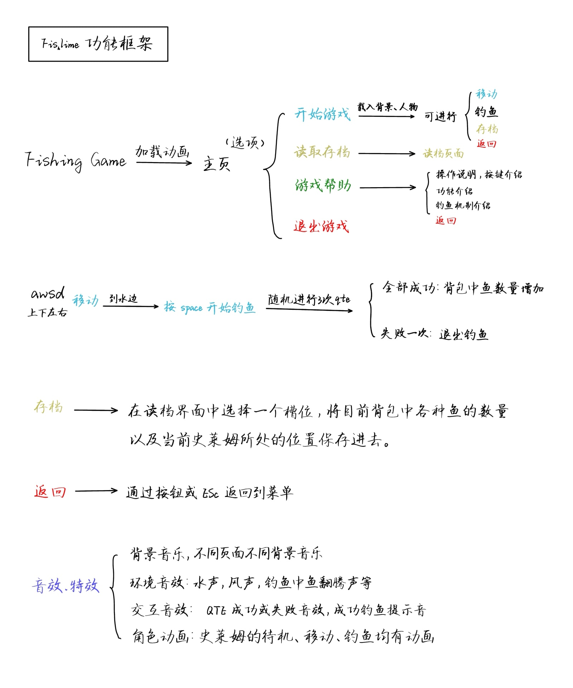
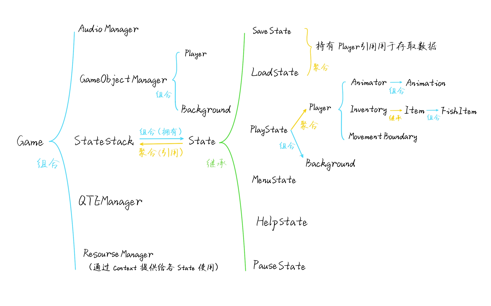

```
Fishlime
 ┣ Fishlime_code  # 项目源代码部分
 ┃ ┣ Sounds       # 游戏音频文件
 ┃ ┃ ┣ BGM
 ┃ ┃ ┃ ┣ Menu.MP3
 ┃ ┃ ┃ ┗ PlayState.MP3
 ┃ ┃ ┣ SoundEffect
 ┃ ┃ ┃ ┣ BtnHovered.mp3
 ┃ ┃ ┃ ┗ ...
 ┃ ┣ font					# 游戏字体文件
 ┃ ┃ ┗ msyh.ttf
 ┃ ┣ img					# 游戏图像文件
 ┃ ┃ ┣ Finish
 ┃ ┃ ┃ ┣ 1.png
 ┃ ┃ ┃ ┗ ...
 ┃ ┃ ┣ Fish
 ┃ ┃ ┃ ┗ ...
 ┃ ┃ ┗ ...
 ┃ ┣ load					# 游戏存档文件
 ┃ ┃ ┣ slot1.txt
 ┃ ┃ ┣ slot2.txt
 ┃ ┃ ┣ slot3.txt
 ┃ ┃ ┗ slot4.txt
 ┃ ┣ x64
 ┃ ┃ ┣ Debug
 ┃ ┃ ┃ ┗ ...
 ┃ ┃ ┣ Release
 ┃ ┃ ┃ ┗ ...
 ┃ ┣ Animation.hpp 	# 游戏源代码文件
 ┃ ┣ Animator.cpp
 ┃ ┣ Animator.hpp
 ┃ ┣ AudioManager.cpp
 ┃ ┣ AudioManager.hpp
 ┃ ┣ Background.cpp
 ┃ ┣ Background.hpp
 ┃ ┣ Button.cpp
 ┃ ┣ Button.hpp
 ┃ ┣ Context.hpp
 ┃ ┣ FishItem.hpp
 ┃ ┣ Fishlime.vcxproj
 ┃ ┣ Fishlime.vcxproj.filters
 ┃ ┣ Fishlime.vcxproj.user
 ┃ ┣ Game.cpp
 ┃ ┣ Game.hpp
 ┃ ┣ GameObject.hpp
 ┃ ┣ GameObjectManager.cpp
 ┃ ┣ GameObjectManager.hpp
 ┃ ┣ HelpState.cpp
 ┃ ┣ HelpState.hpp
 ┃ ┣ Inventory.hpp
 ┃ ┣ InventoryState.cpp
 ┃ ┣ InventoryState.hpp
 ┃ ┣ Item.hpp
 ┃ ┣ LoadState.cpp
 ┃ ┣ LoadState.hpp
 ┃ ┣ MenuState.cpp
 ┃ ┣ MenuState.hpp
 ┃ ┣ MovementBoundary.cpp
 ┃ ┣ MovementBoundary.hpp
 ┃ ┣ PauseState.cpp
 ┃ ┣ PauseState.hpp
 ┃ ┣ PlayState.cpp
 ┃ ┣ PlayState.hpp
 ┃ ┣ Player.cpp
 ┃ ┣ Player.hpp
 ┃ ┣ QTEManager.cpp
 ┃ ┣ QTEManager.hpp
 ┃ ┣ ResourceManager.hpp
 ┃ ┣ SaveState.cpp
 ┃ ┣ SaveState.hpp
 ┃ ┣ State.hpp
 ┃ ┣ StateStack.cpp
 ┃ ┣ StateStack.hpp
 ┃ ┗ main.cpp
 ┣ Fishlime_doc    # 项目说明文档
 ┃ ┣ img
 ┃ ┃ ┗ ...
 ┃ ┣ stage1				 # 第一周项目思路与规划
 ┃ ┃ ┣ README.md
 ┃ ┃ ┗ stage1.pdf
 ┃ ┣ stage2				 # 第二周类设计与实现
 ┃ ┃ ┣ .DS_Store
 ┃ ┃ ┣ Class.pptx
 ┃ ┃ ┣ README.md
 ┃ ┃ ┗ stage2.pdf
 ┃ ┣ final			   # 第三周项目结题报告
 ┃ ┃ ┣ README.md
 ┃ ┃ ┣ final.pdf
 ┃ ┃ ┣ 功能框架.pdf
 ┃ ┃ ┗ 类.pdf
 ┣ Fishlime_exe		 # 项目生成可执行文件
 ┃ ┣ ...
 ┃ ┣ Fishlime.exe	 # 点击运行即可
 ┃ ┗ ...
 ┣ .gitignore
 ┗ README.md
```

## Fishlime

​	

​	本项目是厦门大学2024级计算机科学与技术专业《程序设计实践》课程的大作业，使用 C++ 与 SFML 3.0 库构建的一款像素风2D钓鱼休闲游戏。项目实现了包含栈式状态机、游戏主循环、动画系统、UI交互、存档/读档等核心功能。



### 核心功能

- **栈式状态机**: 设计实现了包含主菜单、游戏、暂停、背包等7个以上独立状态的`StateStack`，以模块化的方式清晰地管理游戏流程。
- **完整的游戏玩法**: 玩家可以控制史莱姆角色在沙滩场景中移动，并通过一个基于QTE（快速反应事件）的迷你游戏进行钓鱼。
- **存档/读档系统**: 能够将玩家的位置和背包物品数据以文本格式持久化到本地文件。
- **音频系统**: 实现了随场景切换的背景音乐，以及超过10种用于交互反馈的音效。

### 架构设计

​	本项目遵循SOLID原则，构建了一套高内聚、低耦合的面向对象架构。



​	系统的核心是一个**栈式状态机 (`StateStack`)**，它驱动着整个游戏的流程。每一个游戏场景（如`PlayState`, `MenuState`）都是一个独立的`State`模块，负责自身的逻辑与渲染。

​	为了解决在状态切换过程中，因对象生命周期冲突可能引发的内存安全问题，项目中设计并实现了一套**延迟执行机制 (`scheduleAction`)**，确保所有状态变更操作都在帧末安全执行，极大地增强了框架的稳定性。

​	更详细的设计思路与实现细节，请参阅完整的[项目报告](https://github.com/Yowe05m/Fishlime/blob/main/Fishlime_doc/final/final.pdf)。

### 构建与运行

1. **环境要求**:
   - Visual Studio 2022 (需支持 C++17 标准)
   - 已配置好的 SFML 3.0 (64-bit) 库
2. **构建步骤**:
   - 克隆本仓库: `git clone https://github.com/Yowe05m/Fishlime.git`
   - 使用 Visual Studio 2022 打开项目 `.sln` 文件。
   - 在VS中配置项目的**包含目录**与**库目录**，使其指向你本地的SFML库路径。
   - 选择 `x64-Debug` 或 `x64-Release` 配置，生成解决方案。
   - **(重要)** 在运行前，请将SFML的动态链接库文件 ( `sfml-graphics-d-3.dll` 等) 复制到生成的可执行文件 (`.exe`) 所在的目录下。

### 操作说明

- **WASD / 方向键**：移动角色 / QTE判定
- **空格键**：在水边时开始钓鱼 
- **ESC**：暂停游戏 / 从当前界面返回